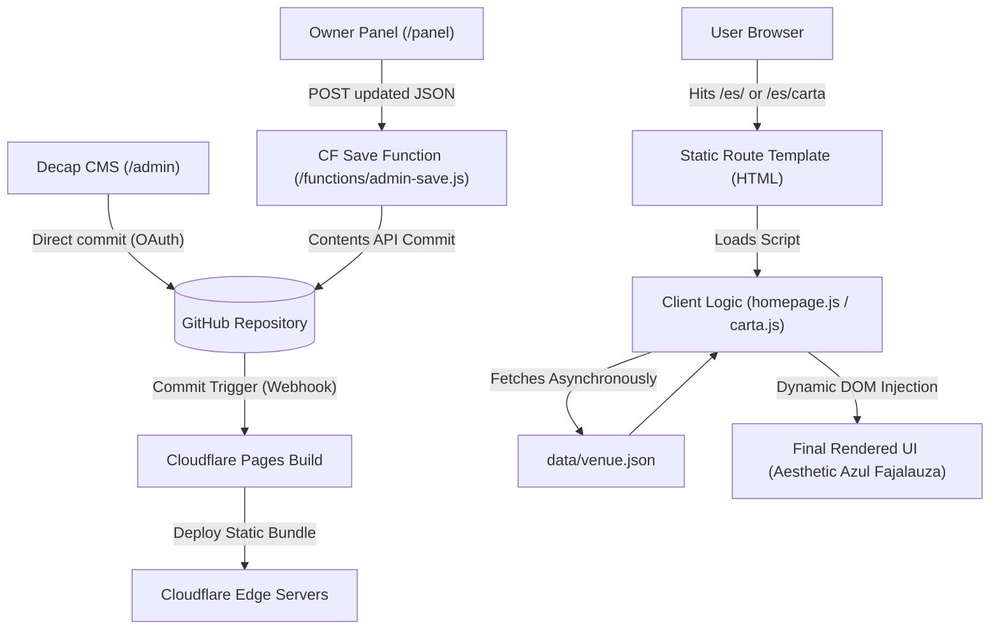

# Bar León — Repository Data Map

This document serves as the complete technical mapping of the Bar León static/Cloudflare Pages website. It details where all public content, CMS configurations, menu data, translation logic, visual assets, and legacy files reside.

---

## 1. Executive Summary

Bar León is a localized, multilingual static website built using **vanilla HTML, CSS, and JS**, hosted on **Cloudflare Pages**. 

The architecture is **content-first** and **git-based**:
1. **Dynamic Content Database**: All client-facing data (menu items, prices, opening hours, active alerts, FAQs, and metadata) is stored in a single JSON file: [venue.json](file:///Users/kokonvt/Projects/bar-leon-cms/data/venue.json).
2. **Runtime Render**: Static HTML templates serve as route gateways. They fetch [venue.json](file:///Users/kokonvt/Projects/bar-leon-cms/data/venue.json) asynchronously and render the layout dynamically on the client side using pure JavaScript.
3. **Dual Admin CMS**:
   - **/panel/**: A custom mobile-first owner panel for daily tasks (updating prices, toggling menus, posting holiday alerts). It saves changes by posting the updated JSON to a Cloudflare Pages Function, which commits it to GitHub.
   - **/admin/**: A developer/schema-level Decap CMS interface that directly edits the git repository.
4. **Automated Deployment**: Any commit to the `main` branch (via local development, the owner panel, or Decap CMS) triggers an automatic Cloudflare Pages rebuild to serve the updated static assets.

---

## 2. Data Flow Diagram

The following text diagram visualizes how data transitions from CMS updates to browser render:



---

## 3. Detailed File Catalog

The table below lists all primary files, their roles, source of truth status, and risk metrics.

| File / Path | Role | Source of Truth? | Used By | Editable by Owner? | Risk Level | Notes |
| :--- | :--- | :---: | :--- | :---: | :---: | :--- |
| [`data/venue.json`](file:///Users/kokonvt/Projects/bar-leon-cms/data/venue.json) | CMS editable data | **Yes** | Client JS, CMS interfaces | **Yes** (via panel) | **High** | Core database. Any corruption breaks the entire website. |
| [`index.html`](file:///Users/kokonvt/Projects/bar-leon-cms/index.html) | Gateway page | **Yes** | Public root `/` | No | Low | Direct language gateway routing users to `/es/`, `/en/`, or `/fr/`. |
| [`es/index.html`](file:///Users/kokonvt/Projects/bar-leon-cms/es/index.html) | Generated/rendered page | No | Public route `/es/` | No | Low | Route template for Spanish homepage. Calls `js/homepage.js`. |
| [`es/carta.html`](file:///Users/kokonvt/Projects/bar-leon-cms/es/carta.html) | Generated/rendered page | No | Public route `/es/carta` | No | Low | Route template for Spanish menu. Calls `js/carta.js`. |
| [`en/index.html`](file:///Users/kokonvt/Projects/bar-leon-cms/en/index.html) | Generated/rendered page | No | Public route `/en/` | No | Low | Route template for English homepage. Calls `js/homepage.js`. |
| [`en/menu.html`](file:///Users/kokonvt/Projects/bar-leon-cms/en/menu.html) | Generated/rendered page | No | Public route `/en/menu` | No | Low | Route template for English menu. Calls `js/carta.js`. |
| [`fr/index.html`](file:///Users/kokonvt/Projects/bar-leon-cms/fr/index.html) | Generated/rendered page | No | Public route `/fr/` | No | Low | Route template for French homepage. Calls `js/homepage.js`. |
| [`fr/carte.html`](file:///Users/kokonvt/Projects/bar-leon-cms/fr/carte.html) | Generated/rendered page | No | Public route `/fr/carte` | No | Low | Route template for French menu. Calls `js/carta.js`. |
| [`js/homepage.js`](file:///Users/kokonvt/Projects/bar-leon-cms/js/homepage.js) | Static fallback & Logic | **Yes** (for JS logic) | All index pages | No | Medium | Fetches `venue.json` and renders homepage structures. |
| [`js/carta.js`](file:///Users/kokonvt/Projects/bar-leon-cms/js/carta.js) | Static fallback & Logic | **Yes** (for JS logic) | All menu pages | No | Medium | Fetches `venue.json` and renders interactive menu tabs. |
| [`css/style.css`](file:///Users/kokonvt/Projects/bar-leon-cms/css/style.css) | Static fallback & Logic | **Yes** (for styles) | All public templates | No | Low | Deploys color tokens (Azul Fajalauza `#1D4D85`) and typography rules. |
| [`admin/config.yml`](file:///Users/kokonvt/Projects/bar-leon-cms/admin/config.yml) | CMS configuration | **Yes** | Decap CMS | No | Medium | Maps input forms to keys in `venue.json`. |
| [`admin/index.html`](file:///Users/kokonvt/Projects/bar-leon-cms/admin/index.html) | Private/admin-only | No | `/admin` route | No | Low | Initializes Decap CMS libraries and handles real-time visual previews. |
| [`panel/index.html`](file:///Users/kokonvt/Projects/bar-leon-cms/panel/index.html) | Private/admin-only | No | `/panel` route | No | Low | HTML structure for custom owner panel. |
| [`panel/app.js`](file:///Users/kokonvt/Projects/bar-leon-cms/panel/app.js) | Private/admin-only | No | `/panel` route | No | Medium | Controller for owner panel (DOM manipulation, inputs, save events). |
| [`functions/admin-save.js`](file:///Users/kokonvt/Projects/bar-leon-cms/functions/admin-save.js) | Private/admin-only | No | Owner Panel | No | Medium | Receives owner updates and commits them to GitHub. |
| [`functions/upload-image.js`](file:///Users/kokonvt/Projects/bar-leon-cms/functions/upload-image.js) | Private/admin-only | No | Owner Panel | No | Medium | Handles image uploads to `assets/images/cariocas/`. |
| [`functions/pin-login.js`](file:///Users/kokonvt/Projects/bar-leon-cms/functions/pin-login.js) | Private/admin-only | No | Owner Panel | No | Medium | Validates owner PIN login. |
| [`wrangler.toml`](file:///Users/kokonvt/Projects/bar-leon-cms/wrangler.toml) | Private/admin-only | **Yes** | Cloudflare Pages CLI | No | Medium | Holds hosting configs and the default production `PANEL_PIN`. |
| [`robots.txt`](file:///Users/kokonvt/Projects/bar-leon-cms/robots.txt) | SEO/GEO metadata | **Yes** | Search Crawlers | No | Low | Disallows indexing of admin/panel routes. |
| [`sitemap.xml`](file:///Users/kokonvt/Projects/bar-leon-cms/sitemap.xml) | SEO/GEO metadata | **Yes** | Search Crawlers | No | Low | Defines public indexable canonical paths. |
| [`docs/BAR_LEON_CANONICAL.md`](file:///Users/kokonvt/Projects/bar-leon-cms/docs/BAR_LEON_CANONICAL.md) | Technical reference | **Yes** (Editorial) | Developers | No | Low | The absolute single source of truth for editorial rules. |
| [`docs/MASTER_FOOD_SYSTEM.md`](file:///Users/kokonvt/Projects/bar-leon-cms/docs/MASTER_FOOD_SYSTEM.md) | Technical reference | **Yes** (Data schema) | Developers | No | Low | Defines the structured schema of meals, barra vs restaurant. |

---

## 4. Route Map

The static routing structure maps client URLs directly to language directories:

| Route Path | Template Target | Loaded Scripts | Fetched Content | Action / Display |
| :--- | :--- | :--- | :--- | :--- |
| `/` | [`index.html`](file:///Users/kokonvt/Projects/bar-leon-cms/index.html) | None (pure CSS) | None | Language gateway screen (Azulejo theme) |
| `/es/` | [`es/index.html`](file:///Users/kokonvt/Projects/bar-leon-cms/es/index.html) | [`js/homepage.js`](file:///Users/kokonvt/Projects/bar-leon-cms/js/homepage.js) | [`data/venue.json`](file:///Users/kokonvt/Projects/bar-leon-cms/data/venue.json) | Homepage (Spanish text, hours status, featured items) |
| `/en/` | [`en/index.html`](file:///Users/kokonvt/Projects/bar-leon-cms/en/index.html) | [`js/homepage.js`](file:///Users/kokonvt/Projects/bar-leon-cms/js/homepage.js) | [`data/venue.json`](file:///Users/kokonvt/Projects/bar-leon-cms/data/venue.json) | Homepage (English translation, hours status) |
| `/fr/` | [`fr/index.html`](file:///Users/kokonvt/Projects/bar-leon-cms/fr/index.html) | [`js/homepage.js`](file:///Users/kokonvt/Projects/bar-leon-cms/js/homepage.js) | [`data/venue.json`](file:///Users/kokonvt/Projects/bar-leon-cms/data/venue.json) | Homepage (French translation, hours status) |
| `/es/carta` | [`es/carta.html`](file:///Users/kokonvt/Projects/bar-leon-cms/es/carta.html) | [`js/carta.js`](file:///Users/kokonvt/Projects/bar-leon-cms/js/carta.js) | [`data/venue.json`](file:///Users/kokonvt/Projects/bar-leon-cms/data/venue.json) | Spanish Menu Tab View (Restaurant, Barra, Wine, Beers) |
| `/en/menu` | [`en/menu.html`](file:///Users/kokonvt/Projects/bar-leon-cms/en/menu.html) | [`js/carta.js`](file:///Users/kokonvt/Projects/bar-leon-cms/js/carta.js) | [`data/venue.json`](file:///Users/kokonvt/Projects/bar-leon-cms/data/venue.json) | English Menu Tab View (Restaurant, Barra, Wine, Beers) |
| `/fr/carte` | [`fr/carte.html`](file:///Users/kokonvt/Projects/bar-leon-cms/fr/carte.html) | [`js/carta.js`](file:///Users/kokonvt/Projects/bar-leon-cms/js/carta.js) | [`data/venue.json`](file:///Users/kokonvt/Projects/bar-leon-cms/data/venue.json) | French Menu Tab View (Restaurant, Barra, Wine, Beers) |
| `/panel` | [`panel/index.html`](file:///Users/kokonvt/Projects/bar-leon-cms/panel/index.html) | [`panel/app.js`](file:///Users/kokonvt/Projects/bar-leon-cms/panel/app.js) | [`data/venue.json`](file:///Users/kokonvt/Projects/bar-leon-cms/data/venue.json) | Owner mobile daily control panel |
| `/admin` | [`admin/index.html`](file:///Users/kokonvt/Projects/bar-leon-cms/admin/index.html) | Decap CMS CDN | [`data/venue.json`](file:///Users/kokonvt/Projects/bar-leon-cms/data/venue.json) | Assistant/developer schema administration |

---

## 5. CMS Edit Map & Write Conflicts

Edits to the website are distributed by user and task priority to prevent schema corruption:

```
                  ┌──────────────────────────────┐
                  │      data/venue.json         │
                  └──────────────┬───────────────┘
                                 │
                 ┌───────────────┴───────────────┐
                 ▼                               ▼
       Owner Panel (/panel/)            Decap CMS (/admin/)
       - Mobile Optimized              - Desktop Developer View
       - Daily operational data         - Structural schema configurations
       - Price & Alert changes          - Custom translation entries
```

### Locking and Save Conflicts
* Both `/panel/` and `/admin/` write to `data/venue.json` in the same git branch (`main`).
* When the Owner Panel saves, [admin-save.js](file:///Users/kokonvt/Projects/bar-leon-cms/functions/admin-save.js) fetches the current file SHA from GitHub.
* If a developer is simultaneously modifying the file in Decap CMS (or via local git), the SHA will mismatch.
* The GitHub Contents API returns a **`409 Conflict`**. The Owner Panel traps this error, alerts the user, and blocks the overwrite.
* **Core Rule**: To prevent data loss, the owner and developer should never edit the site simultaneously.

---

## 6. SEO & GEO Map

SEO metadata is managed via a hybrid static-dynamic approach:

1. **Static HTML Head Elements**: Page titles, OpenGraph tags, alternate language href links (`hreflang`), and canonical tags are defined statically in each route file (e.g. [es/index.html](file:///Users/kokonvt/Projects/bar-leon-cms/es/index.html)).
2. **Dynamic JSON-LD Schema.org Injection**:
   - `js/homepage.js` reads coordinates, phone, and opening hours from `venue.json` and builds a dynamic `application/ld+json` script tag for the `Restaurant` and `WebSite` schemas.
   - `js/carta.js` builds similar schema tags for the `Restaurant`, `Menu`, and `FAQPage` structures.
3. **Robots and Sitemaps**:
   - [robots.txt](file:///Users/kokonvt/Projects/bar-leon-cms/robots.txt) blocks indexing of `/admin/` and `/panel/` and points to the sitemap location.
   - [sitemap.xml](file:///Users/kokonvt/Projects/bar-leon-cms/sitemap.xml) indexes the static gateways and translation folders.

---

## 7. Translation Map

Translations are structured natively within [venue.json](file:///Users/kokonvt/Projects/bar-leon-cms/data/venue.json) to keep languages synchronized:

* **Multilingual Object Structure**: Any text field displayed to the public has localized sub-keys:
  ```json
  "name": {
    "es": "Riñones al Jerez",
    "en": "Kidneys in Sherry",
    "fr": "Rognons au Xérès"
  }
  ```
* **Translation Policy (Culturally Adapted)**:
  - Spanish (`es`) is the **canonical source of truth**.
  - English (`en`) and French (`fr`) translations explain rather than simplify (e.g., traditional dishes like *Tortilla del Sacromonte* retain their Spanish names, but their descriptions explain the ingredients: *egg, brains, and sweetbreads*).
  - General UI labels (like tabs and buttons) are mapped to static variables inside [homepage.js](file:///Users/kokonvt/Projects/bar-leon-cms/js/homepage.js#L9) and [carta.js](file:///Users/kokonvt/Projects/bar-leon-cms/js/carta.js#L28) under `LABELS`.

---

## 8. Price & Opening Hours Mapping

* **Prices**:
  - Standalone items store a price string: `"price": "10,00 €"`.
  - Multi-portion items store a parsed portion string: `"price": "Media 9,00 € / Ración 12,50 €"`.
  - Wines are stored with structured float values: `price_bottle: 17.0` and `price_glass: 3.5`.
* **Opening Hours**:
  - Located under the `hours.schedule` object in [venue.json](file:///Users/kokonvt/Projects/bar-leon-cms/data/venue.json).
  - Organized by weekday. Each entry has a `status` ("open", "partial" [lunch only], or "closed") and a `periods` array mapping opening and closing times.
  - Exceptions (e.g., vacation closures) are stored under the `hours.exceptions` array.

---

## 9. Visual Asset Catalog

Image directories are split based on optimization and access control:

* **Static Core Brand Assets**:
  - [lion-logo.svg](file:///Users/kokonvt/Projects/bar-leon-cms/assets/images/lion-logo.svg): Custom vector brand logo.
  - [favicon.ico](file:///Users/kokonvt/Projects/bar-leon-cms/assets/images/favicon.ico) / [apple-touch-icon.png](file:///Users/kokonvt/Projects/bar-leon-cms/assets/images/apple-touch-icon.png): Browser icons.
  - [og.png](file:///Users/kokonvt/Projects/bar-leon-cms/assets/images/og.png): OpenGraph banner for social shares.
* **Web-Optimized Assets**:
  - Located under `assets/images/web/`.
  - WebP versions are served natively, with PNG fallback wrappers in `<picture>` tags.
  - Covers food photography (e.g. `bar-leon-plato-05.webp` representing *Tomate aliñao*) and ambient shots (e.g. `leon-barra.webp`).
* **Dynamic Owner Uploads ("Cariocas")**:
  - Saved under `assets/images/cariocas/`.
  - Filenames are formatted as `carioca-${Date.now()}.${ext}`.
  - Managed by the `/functions/upload-image.js` upload proxy.

---

## 10. Legacy Files & Conflicts

The following redundant files and conflicts exist in the repository and should be cleaned up or annotated to avoid confusion:

1. **Dead Stories Archive Code**:
   - `js/homepage.js` defines an `initStoriesAlbum` slider helper (lines 618-646) and lists positioning strings (`stories` / `storiesSub`).
   - However, the `.stories-archive` markup is not rendered in `js/homepage.js`'s final `render()` function. This code is currently dead weight.
2. **Geographical Spelling Discrepancy**:
   - [BAR_LEON_CANONICAL.md](file:///Users/kokonvt/Projects/bar-leon-cms/docs/BAR_LEON_CANONICAL.md) establishes: *"Spelling rule: Albaicín (RAE normative). Not 'Albayzín.'"*
   - However, [venue.json](file:///Users/kokonvt/Projects/bar-leon-cms/data/venue.json) under `contact.address.neighborhood` lists `"Albayzín"`, violating the canonical rule.
3. **Historical Research Redundancies**:
   - The `/docs` folder contains various draft plans (`leon-display-v1-plan.md`, `consolidation_plan.md`, `MERGE_PLAN.md`) which refer to old folder structures (`restaurante-bar-leon/01_CONTENT/` etc.) that were deleted during final repository integration. They are useful for history but should be kept strictly read-only.

---

## 11. Safe Editing Rules

To protect the site from crashing, developers and owners must adhere to these policies:

### For the Owner (via /panel/)
* **No Simultaneous Sessions**: Never open `/panel/` on two devices at once, or when a developer is editing the code.
* **Input Price Formats Consistently**: Always type prices exactly as `"X,XX €"` or `"Media X,XX € / Ración Y,YY €"` to avoid formatting issues in the client-side regex parser.

### For Developers
* **Never Edit venue.json Manually on Production**: Do not edit JSON values directly on the deployed server. Always commit edits to git so the Pages builder triggers correctly.
* **Keep Route Templates Pure**: Never hardcode dishes or schedules in the HTML files (`es/index.html`, `en/menu.html`, etc.). All body text must load from `venue.json`.
* **Validate Local Changes**: Always run local schema validation or look at browser previews before pushing changes to the repository schema structure.

---

## 12. Recommended Files to Document Next

To ensure the safety of this project for non-programmers, the following guides should be created:

1. **`docs/DISASTER_RECOVERY.md` (High Priority)**: A guide explaining how to revert a bad commit or restore a backup of `venue.json` directly from the Cloudflare/GitHub UI without using the terminal.
2. **`docs/PIN_ROTATION_GUIDE.md` (Medium Priority)**: Instructions on how to rotate the hardcoded `PANEL_PIN` and `PANEL_SECRET` in wrangler settings or the Cloudflare dashboard.
3. **`docs/TRANSLATION_WORKFLOW.md` (Low Priority)**: Standard operating procedure for updating the English and French translations of new menu items added in Spanish by the owner.
