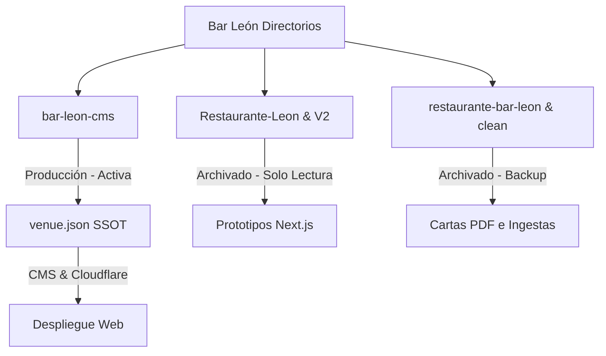

# Plan de Consolidación — Restaurante Bar León

Este documento analiza las carpetas locales del proyecto Bar León y establece una estrategia clara para unificar el desarrollo, eliminar conflictos de datos y definir un flujo de trabajo sostenible **sin eliminar ningún archivo**.

---

## 1. Mapa de Directorios Encontrados

Se han identificado **6 carpetas** en el espacio de trabajo de desarrollo:

1. **`bar-leon-cms` (Directorio Activo / Producción)**: 
   - *Rol*: Repositorio de producción actual. Código estático-first optimizado para Cloudflare Pages con Decap CMS.
   - *Estado*: **Activo (Única Fuente de Verdad)**.
2. **`bar-leon-cms-standalone`**:
   - *Rol*: Copia local del desarrollo del CMS.
   - *Estado*: **Deprecado/Solo Lectura**.
3. **`Restaurante-Leon`**:
   - *Rol*: Primer prototipo de aplicación web en Next.js (v16) + Tailwind CSS (v4) con el diseño de Stitch. Contiene documentación de marca valiosa (`BAR_LEON_MASTER_HANDOFF.md` y `MASTER_BAR_LEON_SOURCE_OF_TRUTH.md`).
   - *Estado*: **Archivado/Histórico**.
4. **`Restaurante-Leon-V2`**:
   - *Rol*: Segundo prototipo en Next.js (v16) con sistema de layouts estricto e internacionalización por subrutas.
   - *Estado*: **Archivado/Histórico**.
5. **`restaurante-bar-leon`**:
   - *Rol*: Repositorio original de investigación y recolección de contenido. Contiene scripts de extracción (`extract.py`, `extract.js`) y cartas PDF originales de 2025.
   - *Estado*: **Archivado/Entorno de Investigación**.
6. **`bar-leon-clean`**:
   - *Rol*: Copia limpia de los datos y traducciones intermedias (`menu.es.json`, `menu.en.json`, `wines.fr.json`) generadas durante la migración a la v2.
   - *Estado*: **Archivado/Copia de Respaldo**.

---

## 2. Diagnóstico Técnico

### A. Lógica Duplicada
- **En JS Estático (`bar-leon-cms`)**: `homepage.js` y `carta.js` duplican funciones de carga (`getLang`), traducción inline (`t`), formateo de precios y horas, y construcción de selectores de idioma.
- **En Next.js (`v1` y `v2`)**: Doble configuración de compilación (`next.config.ts`, `postcss.config.mjs`, `tsconfig.json`), middleware de idioma idéntico y componentes duplicados como `BottomActionBar.tsx` y `LanguageSwitcher.tsx`.
- **Diccionarios**: Traducciones y etiquetas de UI estáticas duplicadas entre `Restaurante-Leon/src/i18n/labels.ts` y `Restaurante-Leon-V2/src/i18n/labels.ts`.

### B. Mejores Componentes (Best Components)
- **UI Estática (Producción)**:
  - **Caja de Edicto del Menú del Día**: Gran valor de marca (aesthetics) con marcas de agua del león de Granada y tipografía caligráfica.
  - **Acordeones de Carta**: Sistema JS nativo ligero que manipula `max-height` dinámicamente basándose en `scrollHeight` (evita saltos bruscos y es totalmente responsive).
  - **Tabs de Selección**: Implementación accesible con soporte nativo de teclado (`ArrowLeft` / `ArrowRight`) y roles WAI-ARIA (`tablist`, `tab`, `tabpanel`).
- **UI React/Next.js (Archivados - para posible migración futura)**:
  - `CofradiaBlock.tsx`: Módulo de integración cultural cofrade de Granada.
  - `FamiliaLeon.tsx` y `HerenciaBlock.tsx`: Diseños editoriales narrativos excelentes que muestran fotos históricas familiares y texto de época.
  - `MediaMentions.tsx`: Bloque de menciones en prensa y opiniones locales.
  - `AllergenUI.tsx`: Selector y visualizador de alérgenos.

### C. Activos Reutilizables (Reusable Assets)
- **Tipografías**: Fuentes locales exclusivas `granaina-limpia.otf` y `granaina-sucia2.otf` (`assets/fonts/`). Indispensables para la identidad andaluza.
- **Logotipos**: Vectorial SVG `lion-logo.svg` (`assets/images/`), utilizado como watermark e isotipo en cabecera.
- **Fotografía**: Contenidos documentales y fotos de platos en `Restaurante-Leon/Bar-leon-fotos/` y `bar-leon-clean/Bar-Leon.zip`.

### D. Fuentes de Menú en Conflicto (Conflicting Menu Sources)
- **Producción**: `bar-leon-cms/data/venue.json` es la **fuente de datos definitiva** leída por el frontend de producción en tiempo real y modificada por el CMS.
- **Conflictivos**: 
  - Archivos JSON sueltos en `restaurante-bar-leon/02_DATA/` (`carta.es.json`, `vinos.es.json`).
  - Diccionarios en `Restaurante-Leon-V2/src/content/data/` (`menu.es.json`, `daymenu.es.json`, `wines.es.json`).
  - *Peligro*: Cualquier cambio hecho en el panel administrativo (`/admin/`) escribe en `venue.json` de la carpeta de producción, dejando todos estos JSON desactualizados.

### E. Archivos Deprecados
- Scripts `extract.py` y `extract.js` en `restaurante-bar-leon`.
- Archivos `.zip` y carpetas duplicadas temporales (`bar-leon-cms-standalone`).
- Configuración y dependencias Next.js obsoletas en repositorios de prueba.

### F. Arquitecturas Rotas / Deuda Técnica
- **Separación de repositorios**: Dos proyectos Next.js distintos con arquitecturas de enrutado mezcladas (un proyecto v1 usa client-views clásicas, y el v2 usa carpetas `(standard)` y `(immersive)`).
- **Desconexión del CMS**: Ninguno de los proyectos Next.js está conectado a Decap CMS, por lo que no pueden consumirse en producción sin romper el flujo editorial del local.

---

## 3. Plan de Consolidación (Sin Eliminación de Archivos)

Para evitar pérdidas de datos y mantener el histórico intacto de forma segura, se propone el siguiente flujo de consolidación no-destructivo:

### Fase 1: Bloqueo de Carpetas Históricas
1. Añadir un archivo `ARCHIVED_DO_NOT_EDIT.md` en la raíz de:
   - `bar-leon-cms-standalone`
   - `Restaurante-Leon`
   - `Restaurante-Leon-V2`
   - `restaurante-bar-leon`
   - `bar-leon-clean`
2. El archivo de bloqueo indicará explícitamente que todo el desarrollo activo y actualizaciones de datos ocurren exclusivamente en `bar-leon-cms`.

### Fase 2: Sincronización y Respaldo de Fotos
1. Copiar de forma segura las fotografías de comida auténticas del local de `Restaurante-Leon/Bar-leon-fotos/` hacia `bar-leon-cms/assets/images/food/` si se requiere incorporar contenido gráfico real en el futuro.
2. Mantener `Bar-Leon.zip` en `bar-leon-clean` como copia de seguridad inalterable (resguardo ante desastres).

### Fase 3: Unificación de Documentación en Producción
1. Mover los documentos maestros de identidad de marca:
   - Copiar `BAR_LEON_MASTER_HANDOFF.md` y `MASTER_BAR_LEON_SOURCE_OF_TRUTH.md` (de `Restaurante-Leon`) a `bar-leon-cms/docs/` para que los desarrolladores los consulten en el repositorio principal.

### Fase 4: Centralización Absoluta de Datos (SSOT)
1. Declarar formalmente a `bar-leon-cms/data/venue.json` como la única base de datos operativa.
2. Si en el futuro se migra a React/Next.js, el cargador de datos del framework deberá consumir este archivo único de manera dinámica (o a través de una API estática en Cloudflare) en lugar de usar JSONs fragmentados.
