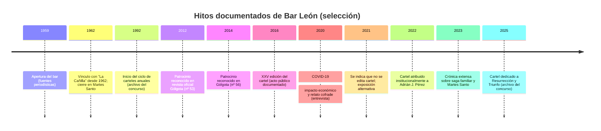

# Restaurante Bar León de Granada: historia, huella hemerográfica, vínculos cofrades y presencia cultural

## Resumen ejecutivo

Restaurante Bar León es un establecimiento histórico vinculado de forma especialmente intensa a la cultura cofrade local y a las dinámicas sociales del centro urbano. En la prensa local se documenta reiteradamente su apertura en 1959 y su carácter de negocio familiar multigeneracional, con una narrativa constante: tradición gastronómica, clientela fiel (local y turística) y un rol de “punto de encuentro” para quienes viven la Semana Santa desde dentro. citeturn8view1turn8view0turn16search0turn28search4turn29view0

La relación con la Semana Santa aparece en tres planos documentados: (a) el vínculo familiar con la hermandad del Martes Santo conocida como “La Cañilla”, con constancia explícita de participación “desde 1962” y cierre del local ese día para hacer estación de penitencia; (b) el bar como espacio de sociabilidad cofrade (tertulias, reuniones informales, “tercer tiempo” tras cultos y cabildos), con testimonios en prensa sobre proyectos y recaudaciones surgidos allí; y (c) la producción cultural propia: un cartel anual y un concurso (principalmente fotográfico) con trayectoria larga, además del despliegue estacional de carteles recibidos y archivados (miles) que convierten el local en un “museo” efímero de Cuaresma. citeturn36view0turn8view0turn8view1turn32view0turn32view2turn32view3turn35view1

Como fuentes “semi-oficiales” cofrades, existen evidencias relevantes: en la revista oficial Gólgota (editada por la Real Federación de Hermandades y Cofradías de Semana Santa de la ciudad) figura Restaurante Bar León en agradecimientos por patrocinio (al menos en números de 2012 y 2014), lo que sugiere una relación sostenida con el ecosistema institucional de la Semana Santa granadina. citeturn33view1turn12view2

En cuanto a localización, la dirección contemporánea (calle Pan, 1) se repite en prensa y en convocatorias cofrades; además, una pieza periodística de 2019 afirma que el establecimiento actual está “justo frente” al local donde se fundó el “primer León”, apuntando a un desplazamiento de acera o a un cambio de local en el mismo entorno (sin fecha exacta documentada en las fuentes consultadas). citeturn8view1turn29view0turn9view1

Lagunas principales: no se ha hallado (en acceso abierto) la fecha exacta (día/mes) de apertura de 1959, ni documentación municipal de licencias/traspasos, ni la fecha del posible cambio de local “frente” al original. Tampoco aparece en las fuentes accesibles el listado nominal de “varias cofradías” de las que el bar habría sido “hermano” como persona jurídica en los años 80, ni el nombre de la corporación de la que sería “hermano mayor honorario” (mención sin especificar). citeturn8view0turn29view0

## Fuentes, metodología y límites de evidencia

El presente informe se basa en una triangulación de: prensa local y regional accesible en archivo digital (especialmente reportajes y entrevistas), publicaciones y páginas de entidades cofrades (convocatorias, agendas, sitios oficiales), y obras de carácter institucional/ académico impulsadas desde el ámbito municipal y universitario. citeturn8view1turn8view0turn16search0turn17view1turn15view1turn9view1

Para la “hemeroteca” se han priorizado piezas fechadas y firmadas en medios locales y suplementos gastronómicos, así como artículos que incorporan declaraciones directas de miembros de la familia propietaria o información contextual verificable (dirección, año de apertura, prácticas). citeturn8view1turn8view0turn16search0turn29view1

Límites y accesibilidad: algunos sitios relevantes no pudieron consultarse plenamente en el momento del rastreo por restricciones técnicas (por ejemplo, bloqueos de acceso en redes sociales y errores de servidor en webs concretas), por lo que se opta por apoyarse en fuentes alternativas (prensa, PDFs oficiales, páginas cofrades accesibles) para sostener las afirmaciones. citeturn38view0turn21view0turn22view1

## Historia empresarial: fundación, propietarios y localización

La fecha de apertura de 1959 aparece como dato estable en múltiples piezas periodísticas y testimoniales. En un reportaje gastronómico se afirma explícitamente que el bar “subió la persiana” en 1959, atribuyendo la apertura al abuelo (Antonio León) según declaración de la tercera generación. citeturn8view1turn8view0turn16search0turn28search4

En cuanto a la continuidad familiar, varias fuentes describen “tres generaciones” al frente del establecimiento, con referencias nominales a Joaquín León Guerra y su hijo (también llamado Joaquín) como responsables tras la barra, y con presencia pública de otros miembros identificados como “Júnior” (Antonio León) en el relato cofrade y en actos del cartel. citeturn8view1turn36view0turn16search0turn35view1

Sobre el emplazamiento, la dirección en calle Pan se repite de forma consistente (cercanía a Plaza Nueva y eje de paso de cofradías). Un artículo de 2019 añade un matiz histórico: el “establecimiento actual” estaría “justo frente” al local donde se fundó el “primer León”, lo que sugiere un cambio de local en el mismo tramo de calle (sin constar en esa pieza la fecha del traslado ni el número exacto del local original). citeturn29view0turn8view0turn9view1

Existe también una “historia de movilidad previa” a la fijación en Granada: un reportaje sitúa el origen familiar en Andújar y menciona un paso por Almería antes de asentarse en la taberna de la calle Pan. Este dato se refuerza en la crónica cofrade de 2023, que describe a la familia como procedente de Andújar y enraizada en Granada. citeturn8view1turn36view0

En registros mercantiles/empresariales de consulta pública aparece una ficha de “Restaurante Bar Leon C.B.” con fecha de constitución en 2013, dato útil para entender la formalización jurídica moderna pero no equivalente a la apertura histórica del negocio (1959) que documentan las fuentes periodísticas. citeturn3view2turn8view1

Tabla de hitos con evidencia disponible (selección):

| Fecha | Hito | Tipo de evidencia |
|---|---|---|
| 1959 | Apertura del bar; atribución al abuelo (Antonio León) | Prensa/entrevista (archivo digital) citeturn8view1turn8view0turn16search0turn28search4 |
| 1962 | Vínculo familiar continuado con “La Cañilla” desde ese año; cierre del local en Martes Santo | Prensa (crónica cofrade) citeturn36view0 |
| Años 80 | El bar habría figurado como “hermano” (persona jurídica) de varias cofradías; reforma estatutaria elimina esa posibilidad y pasan a figurar como hermanos personas físicas de la familia | Prensa (entrevista) citeturn8view0 |
| 1992 | Inicio del ciclo de cartelería anual (1ª edición atribuida a Borriquilla) | Blog del establecimiento (archivo) citeturn32view0 |
| 2012 (dic.) | Aparición en agradecimientos por patrocinio en Gólgota (revista oficial de Semana Santa) | PDF oficial (revista) citeturn33view1 |
| 2014 (cuaresma) | Nuevo agradecimiento por patrocinio en Gólgota | PDF oficial (revista) citeturn12view2 |
| 2016 (feb.) | XXV edición del cartel; dedicado a María Santísima de la Concepción; acto de presentación y concurso con exposición de obras | Prensa (galería/acto) citeturn35view1 |
| 2020 (mar-abr) | Impacto COVID-19: cierre y crisis; el bar declara depender en parte de Semana Santa; cartelería 2020 presentada el 10 de marzo | Prensa (entrevista) citeturn35view0 |
| 2021 (cuaresma) | Se indica que ese año no se edita cartel; exposición improvisada de carteles recordados | Prensa (entrevista) citeturn8view0 |
| 2022 | Cartel del bar atribuido a Adrián J. Pérez (mención institucional) y descrito como “pintura” en el archivo del propio concurso | Comunicación institucional + archivo del concurso citeturn17view2turn32view3 |
| 2023 (abril) | Crónica “Un Martes Santo entre leones”: detalla la saga cofrade, cierre del bar y prácticas de apoyo a hermandades | Prensa (crónica) citeturn36view0 |
| 2025 | Cartel dedicado a Resurrección y Triunfo según el archivo del concurso | Archivo del concurso citeturn32view3 |



## Bar León y la Semana Santa: cofradías, cartelería y sociabilidad cofrade

La documentación disponible muestra que el bar no solo se asocia “ambientalmente” a la Semana Santa, sino que forma parte de su infraestructura social: cierre en Martes Santo por participación de la familia en la hermandad popularmente conocida como “La Cañilla”, vínculo fechado “desde 1962”, y continuidad de cuatro generaciones en esa vivencia. citeturn36view0turn8view1

La prensa recoge además escenas de la vida cofrade “en el bar”: llegada de costaleros tras mudás, consumiciones previas a vestirse, recepción de juntas de gobierno tras cabildos, y apoyo material (bocadillos, caldo). En la crónica de 2023 aparecen anécdotas de preparación de bocadillos para la Hermandad del Silencio y la integración del bar en la logística emocional y cotidiana del calendario cofrade. citeturn36view0turn35view1

En una entrevista en prensa se atribuye al establecimiento un papel de “casa de hermandad” de facto en épocas en que muchas corporaciones no disponían de sede social propia: se mencionan allí proyectos y recaudaciones (p. ej., donativos iniciales para una coronación, fondos para afrontar una sanción federativa por el uso de denominaciones, reuniones con directores de banda y escultores, etc.). Aunque estas afirmaciones son testimoniales (no actas publicadas), están recogidas en entrevista directa y aportan trazabilidad narrativa. citeturn8view0

El eje cultural más singular es la cartelería anual. En un reportaje de 2018 se explica que el bar recibe carteles de Semana Santa de múltiples lugares (España y extranjero) y los archiva, acumulando miles, y que edita un cartel propio desde hace décadas, rotando hermandades para que “todas pasen por el cartel”. citeturn8view1

Ese ciclo aparece sistematizado en el archivo del propio concurso (blog), donde se listan ediciones desde 1992 con la hermandad protagonista y autoría (foto/pintura). Como corroboración en prensa, la XXV edición de 2016 se documenta como acto público con presentación y concurso (63 capturas expuestas, jurado, etc.). citeturn32view0turn32view2turn32view3turn35view1

En el plano institucional cofrade, el bar figura como punto de venta en convocatorias de una cofradía (ejemplo: certamen de bandas en 2015 con entradas a la venta en “Bar León (C/Pan 1)”), lo que evidencia una relación operativa con eventos de hermandades. citeturn9view1

image_group{"layout":"carousel","aspect_ratio":"16:9","query":["Bar León Granada fachada azulejos \"Restaurante Bar León\"","Bar León Granada interior carteles Semana Santa","Calle Pan Granada Plaza Nueva Bar León","cartel Bar León Semana Santa Granada"] ,"num_per_query":1}

```mermaid
graph LR
  A[Bar León] -->|cierra Martes Santo| B["Hermandad 'La Cañilla' (Humildad)"]
  A -->|cartel anual + concurso| C[Cartel Bar León]
  C -->|ediciones documentadas| D[Hermandades protagonistas]
  A -->|punto de encuentro / tertulias| E[Actos cofrades y sociabilidad]
  E -->|tertulia pregoneros 2022| F[COPE - Cruz de Guía]
  A -->|patrocinio reconocido| G[Gólgota (revista oficial)]
  A -->|punto de venta 2015| H["Cofradía del Rescate"]
  A -->|cobertura y entrevistas| I[Prensa local]
  I --> J[Cadena SER]
  I --> K[GranadaDigital]
  I --> L[Granada Hoy]
  I --> M[Ideal Gourmet]
  A -->|referente visual cuaresmal| N["Legatum fidei (Ayuntamiento)"]
```

## Cobertura hemerográfica y presencia cultural

La cobertura en archivo digital muestra varios “picos” temáticos: Cuaresma/Semana Santa (gastronomía de vigilia, ambiente cofrade, cartelería, conciertos), pandemia (impacto económico y continuidad simbólica), y piezas de memoria urbana (bares históricos). citeturn8view1turn8view0turn35view0turn16search19turn29view1

En 2018 se describe el establecimiento como parte de la “esencia” de la Semana Santa granadina, se fija el dato de 1959 y se documenta el cierre del Martes Santo por la participación en la hermandad del Señor de la Humildad (“La Cañilla”), además del rol como punto de encuentro de hermanos de varias cofradías. citeturn8view1

En 2021, una entrevista en prensa lo sitúa como “santuario” cofrade en calle Pan, afirma la apertura en 1959 y aporta un conjunto de detalles de gran valor analítico: tensiones jurídicas por la “hermandad” de personas jurídicas en los años 80, prácticas de hospitalidad con una cofradía concreta (caldo y una “chicotá a pulso”), y el carácter del bar como incubadora informal de proyectos cofrades en décadas pasadas. citeturn8view0

En 2023, la crónica “Un Martes Santo entre leones” refuerza el componente de “saga” y lo enmarca en un relato generacional: cierre del bar, participación desde 1962, y la vivencia doméstica y comunitaria de la Semana Santa, incluyendo referencias a labores de apoyo a otras hermandades (bocadillos, etc.). citeturn36view0

Fuera de la prensa estricta, hay presencia en obras de carácter institucional y académico. El volumen “Legatum fidei: patrimonio e identidad de las hermandades de Granada” (editor: Ayuntamiento de Granada; ISBN disponible) menciona explícitamente la “edición de carteles como el del Bar León” como uno de los referentes visuales de la Cuaresma granadina, situándolo en un marco de análisis patrimonial e identitario, más allá de la anécdota. citeturn15view1turn14view0

En cuanto a testimonios y “oralidad” mediada, hay al menos tres líneas: (1) entrevista radiofónica (Cadena SER) con padre e hijo sobre memoria urbana de barra, clientela de décadas y 1959 como hito fundacional; (2) entrevista en GranadaDigital durante COVID-19 con afirmaciones económicas (peso de Semana Santa en ingresos) y continuidad cofrade; (3) recopilaciones de opiniones de lectores/clientes en Ideal Gourmet en 2020, que funcionan como corpus testimonial (no verificable individualmente) sobre afecto social y reputación. citeturn16search0turn35view0turn28search4turn28search22

Tabla de menciones en hemeroteca digital y archivo web (selección priorizada por valor documental):

| Fecha (publicación) | Medio/soporte | Pieza (tema) | Valor documental |
|---|---|---|---|
| 23/03/2018 | Granada Hoy | “Una parada obligada en Semana Santa” (historia, 1959, prácticas de vigilia, cartelería, concierto) | Alto (entrevista + datos históricos) citeturn8view1 |
| 24/03/2021 | Granada Hoy | “El León, un bar de cofrades” (entrevista, vínculos con hermandades, proyectos) | Alto (entrevista + relación cofrade detallada) citeturn8view0 |
| 05/04/2023 | Granada Hoy | “Un Martes Santo entre leones” (saga familiar, 1962, cierre, anécdotas) | Alto (crónica extensa + datación 1962) citeturn36view0 |
| 24/02/2016 | GranadaDigital | “El Bar León presenta su cartel… 2016” (acto público, XXV edición, concurso) | Medio-alto (crónica de acto + trazabilidad de concurso) citeturn35view1 |
| 10/04/2020 | GranadaDigital | Entrevista COVID-19 (impacto, economía, cartelería 2020) | Medio-alto (entrevista; cifras testimoniales) citeturn35view0 |
| 09/12/2022 | Cadena SER | Entrevista “Hora 25 Granada - A Fondo” (memoria urbana, 1959, clientela) | Alto (audio + texto con datos base) citeturn16search0 |
| 12/04/2019 | Ideal Gourmet | “Ruta por los bares más cofrades…” (local “frente” al original) | Medio-alto (dato espacial histórico; sin fecha de traslado) citeturn29view0 |
| 04/04/2025 | Ideal Gourmet | “Los mejores platos…” (definición “bar de cofrades”, ritual sensorial cuaresmal) | Medio (reportaje gastronómico con cita directa) citeturn29view1 |
| 04/10/2022 | COPE | “Tertulia de pregoneros…” (acto cofrade en el bar) | Medio-alto (convocatoria fechada, lugar explícito) citeturn17view1 |

## Evidencia visual, PDFs y cartografía de localizaciones

En fotografía periodística y galerías, existe evidencia visual abundante asociada a (a) la iconografía del local (azulejería/rotulación; salones), (b) la exposición de cartelería durante Cuaresma, y (c) los actos de presentación del cartel. Ejemplos claros: la galería de 2016 publica imágenes del acto con miembros identificados de la familia y del espacio interior; y Granada Hoy acompaña varios reportajes de imágenes del local y de la saga familiar. citeturn35view1turn8view1turn36view0

En PDFs cofrades oficiales, se documenta su presencia como patrocinador en la revista Gólgota (revista oficial; editada por la Real Federación), con agradecimientos explícitos por patrocinio (al menos en nº 53 / diciembre 2012 y nº 56 / cuaresma 2014). Esto constituye evidencia de “inserción” en el circuito institucional, más allá de la hostelería. citeturn33view1turn12view2

Cartografía: las fuentes consultadas sitúan el bar en calle Pan (número 1) y lo describen como ubicado “junto a Plaza Nueva”. La pieza de 2019 indica que el local actual está “justo frente” al local fundacional, lo que permite representar dos puntos en el mismo tramo, pero sin identificar con precisión el número del local originario ni la fecha del cambio. citeturn29view0turn8view1turn9view1

A continuación se incluyen enlaces directos (incluyendo PDFs) y mapas. Para cumplir la exigencia de URLs explícitas, se listan en bloques de código.

```text
ARTÍCULOS / HEMEROTECA DIGITAL (selección con URL directa)

Granada Hoy (23/03/2018) - "Una parada obligada en Semana Santa"
https://www.granadahoy.com/vivir/BparadaB-obligada-Semana-Santa_0_1229577292.html

Granada Hoy (24/03/2021) - "El León, un bar de cofrades"
https://www.granadahoy.com/semanasanta/bar-leon-semana-santa-granada_0_1558046241.html

Granada Hoy (05/04/2023) - "Un Martes Santo entre leones: legado de padres a hijos"
https://www.granadahoy.com/semanasanta/Martes-Santo-leones-legado-padres_0_1780022677.html

GranadaDigital (24/02/2016) - "El Bar León presenta su cartel de Semana Santa 2016 (Galería)"
https://www.granadadigital.es/el-bar-leon-presenta-su-cartel-de-semana-santa-2016-galeria/

GranadaDigital (10/04/2020) - Entrevista a Joaquín León (COVID-19 y cofradías)
https://www.granadadigital.es/joaquin-leon-cuando-crisis-acabe-habra-que-reinventarse-poder-recuperar-negocio-perdido/

Cadena SER (09/12/2022) - Entrevista (texto + audio)
https://cadenaser.com/andalucia/2022/12/09/joaquin-leon-seguimos-conservando-clientes-que-no-han-dejado-de-venir-a-nuestro-bar-desde-hace-mas-de-50-anos-radio-granada/

Ideal Gourmet (12/04/2019) - "De ruta por los bares más cofrades de Granada"
https://gourmet.ideal.es/actualidad/ruta-bares-cofrades-20190412203131-nt.html

Ideal Gourmet (04/04/2025) - "Los mejores platos para saborear la vigilia en Granada"
https://gourmet.ideal.es/actualidad/mejores-platos-saborear-vigilia-granada-20250404001317-nt.html

COPE (04/10/2022) - "Tertulia del Pregoneros organizada por 'La llave'"
https://www.cope.es/emisoras/andalucia/granada-provincia/granada/cruz-de-guia/noticias/tertulia-20221004_2325508
```

```text
PDFs Y DOCUMENTOS COFRADES / INSTITUCIONALES (acceso directo)

Gólgota nº 53 (diciembre 2012) - PDF (incluye agradecimiento a patrocinadores con Restaurante Bar León)
https://www.centroestudioscofrades.org/wp-content/uploads/2020/09/53.pdf

Gólgota nº 56 (cuaresma 2014) - PDF (incluye agradecimiento a patrocinadores con Restaurante Bar León)
https://www.centroestudioscofrades.org/wp-content/uploads/2020/09/56.pdf

Legatum fidei: patrimonio e identidad de las hermandades de Granada (Ayuntamiento de Granada; ficha + descarga)
https://www.researchgate.net/publication/375060764_Legatum_fidei_patrimonio_e_identidad_de_las_hermandades_de_Granada
```

```text
ARCHIVO DEL CONCURSO / CARTELERÍA DEL PROPIO ESTABLECIMIENTO

Archivo-resumen de ediciones (incluye lista de 1992–2025)
https://cartelbarleon.blogspot.com/2009/01/foto-21.html
```

```text
MAPAS (ubicación actual y aproximación histórica)

Ubicación actual (Calle Pan, 1 - entorno Plaza Nueva) - Google Maps (búsqueda)
https://www.google.com/maps/search/?api=1&query=Calle%20Pan%201%2C%20Granada%2C%20Spain

Ubicación actual - OpenStreetMap (búsqueda)
https://www.openstreetmap.org/search?query=Calle%20Pan%201%20Granada

Local original (según Ideal Gourmet 2019, "justo frente" al actual): no consta número exacto en la fuente.
Recomendación metodológica: contrastar con padrón de licencias/aperturas del Ayuntamiento (si se obtiene acceso).
```

Tabla de fuentes utilizadas (tipo y fiabilidad, con nota metodológica):

| Fuente | Tipo | Fiabilidad orientativa | Por qué |
|---|---|---:|---|
| Granada Hoy (2018/2021/2023) | Prensa local (reportajes/entrevistas) | Alta | Fechado, firmantes, declaraciones directas y datos repetidos (1959, calle Pan, prácticas) citeturn8view1turn8view0turn36view0 |
| Cadena SER (2022) | Radio + transcripción | Alta | Audio identificable y texto; refuerza 1959 y continuidad familiar citeturn16search0 |
| GranadaDigital (2016/2020) | Prensa digital local | Media-alta | Cobertura de acto (2016) y entrevista (2020) con datos internos citeturn35view1turn35view0 |
| Gólgota (PDFs) | Revista oficial cofrade (Real Federación) | Alta | Documento institucional; mención explícita como patrocinador citeturn33view1turn12view2 |
| Cofradía del Rescate (web) | Sitio oficial de hermandad | Alta | Convocatoria/venta de entradas con punto de venta “Bar León (C/Pan 1)” citeturn9view1 |
| Legatum fidei (Ayuntamiento/UGR) | Publicación institucional-académica | Alta | ISBN, editor municipal, autores universitarios; incluye mención analítica al “cartel del Bar León” citeturn15view1turn14view0 |
| Blog del concurso (cartelbarleon) | Fuente primaria autopublicada | Media | Útil para listado y mecánica del concurso; requiere contraste externo para hitos no corroborados citeturn32view0turn32view3 |
| Ideal Gourmet (2019/2025) | Suplemento/medio gastronómico | Media-alta | Aporta dato espacial “frente al original” y citas de gerencia; no aporta actas/fechas de traslado citeturn29view0turn29view1 |
| Comentarios de lectores (Ideal Gourmet 2020) | UGC (testimonios) | Media-baja | Indicativo de percepción social, no verificable individualmente citeturn28search4turn28search22 |

**Información que falta o no se ha podido documentar en acceso abierto (declaración explícita):** fecha exacta de apertura (día/mes de 1959), identidad completa de propietarios a lo largo de todas las décadas con documentación registral histórica, fecha y número del local original (solo se indica “frente” al actual), y referencias en hemerotecas históricas (pre-digitales) que mencionen explícitamente el negocio en los años 60–90 (no localizadas en lo consultado). citeturn29view0turn8view1turn8view0